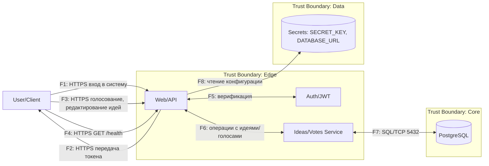

# DFD — Data Flow Diagram (Idea Voting Board)

## Диаграмма (Mermaid)

## Список потоков

| ID | Откуда → Куда | Канал/Протокол           | Данные/PII                             | Комментарий                                               |
|----|---------------|--------------------------|----------------------------------------|-----------------------------------------------------------|
| F1 | User → API    | HTTPS                    | username, email, password              | Регистрация/логин: POST /api/users/new, /api/token        |
| F2 | API → User    | HTTPS                    | JWT                                    | Ответ с access-токеном                                    |
| F3 | User → API    | HTTPS                    | Bearer JWT, idea payload               | Защищенные CRUD/голосование                               |
| F4 | User → API    | HTTPS                    | —                                      | Healthcheck/статические GET                               |
| F5 | API ↔ Auth    | in-proc (function calls) | password hash compare; JWT sign/verify | Внутрипроцессные вызовы модуля аутентификации             |
| F6 | API ↔ Service | in-proc (function calls) | domain objects                         | Бизнес-операции идей/голосов                              |
| F7 | Service ↔ DB  | TCP (5432)               | user, ideas, votes, password_hash      | SQLAlchemy → PostgreSQL                                   |
| F8 | API → Secrets | OS env / volume          | SECRET_KEY, DATABASE_URL               | Чтение конфигурации при старте; критично для безопасности |
